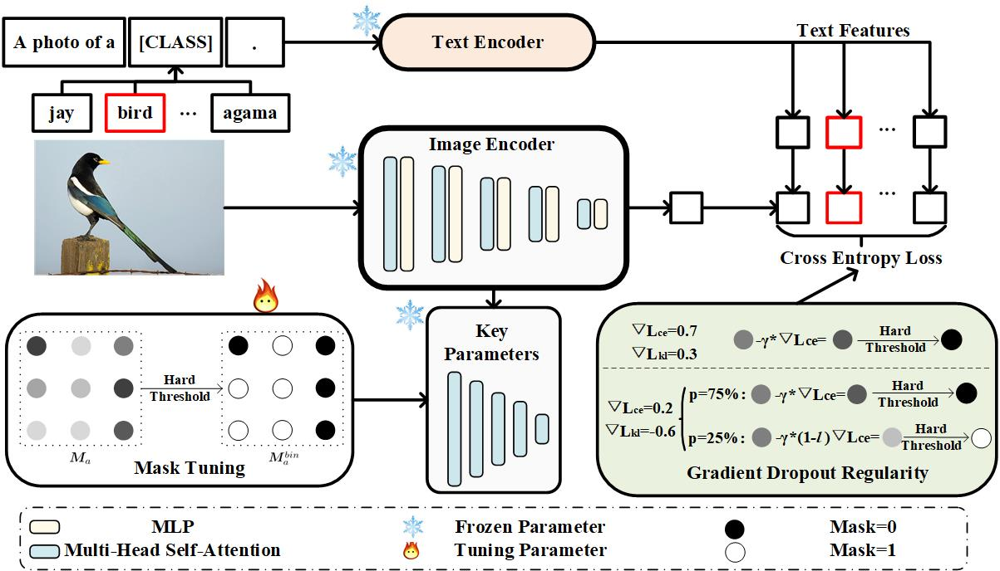

# Regularized Mask Tuning: Uncovering Hidden Knowledge in Pre-trained Vision-Language Models

This repository provides a new type of tuning method, termed as regularized mask tuning, which masks the network parameters through a learnable selection.




## Overview of methods supported by our method:

[//]: # (<details open>)

[//]: # (<summary><b>Supported Methods &#40;8&#41;</b></summary>)

[//]: # ()
[//]: # (> - [x] [![]&#40;https://img.shields.io/badge/NeurIPS'2020-GRAF-f4d5b3?style=for-the-badge&#41;]&#40;https://github.com/autonomousvision/graf&#41;)

[//]: # (> - [x] [![]&#40;https://img.shields.io/badge/NeurIPS'2022-EpiGRAF-d0e9ff?style=for-the-badge&#41;]&#40;https://github.com/universome/epigraf&#41;)

[//]: # (> - [x] [![]&#40;https://img.shields.io/badge/CVPR'2021-π&#8211;GAN-D14836?style=for-the-badge&#41;]&#40;https://github.com/marcoamonteiro/pi-GAN&#41;)

[//]: # (> - [x] [![]&#40;https://img.shields.io/badge/CVPR'2022-EG3D-c2e2de?style=for-the-badge&#41;]&#40;https://github.com/NVlabs/eg3d&#41;)

[//]: # (> - [x] [![]&#40;https://img.shields.io/badge/CVPR'2022-GRAM-854?style=for-the-badge&#41;]&#40;https://github.com/microsoft/GRAM&#41;)

[//]: # (> - [x] [![]&#40;https://img.shields.io/badge/CVPR'2022-StyleSDF-123456?style=for-the-badge&#41;]&#40;https://github.com/royorel/StyleSDF&#41;)

[//]: # (> - [x] [![]&#40;https://img.shields.io/badge/CVPR'2022-VolumeGAN-535?style=for-the-badge&#41;]&#40;https://github.com/genforce/volumegan&#41;)

[//]: # (> - [x] [![]&#40;https://img.shields.io/badge/ICLR'2022-StyleNeRF-1223?style=for-the-badge&#41;]&#40;https://github.com/facebookresearch/StyleNeRF&#41;)

[//]: # (</details>)


> Zheng, Kecheng and Wu, Wei and Feng$, Ruili and Zhu Kai and Liu, Jiawei and Zhao, Deli and Zha Zheng-Jun and Chen Wei and Shen, Yujun <br>
> ** <br>

[[Paper](https://arxiv.org/abs/2306.12423)]

## Code Coming Soon

- [ ] Release training code.
- [ ] Release pretrained models.


## Experiments:

| Method            | ImageNet | Caltech101 | FGVCAircraft | StanfordCars | Flowers102 | OxfordPets | Food101 | DTD   | EuroSAT | UCF101 | SUN397 | Average   | Gain       |
|-------------------|----------|------------|--------------|--------------|------------|------------|---------|-------|---------|--------|--------|-----------|------------|
| Zero-shot CLIP    | 66.73    | 92.94      | 24.72        | 65.32        | 71.34      | 89.21      | 86.06   | 44.39 | 47.60   | 66.75  | 62.50  | 65.23     | -          |
| R-AMT             | 73.07    | 97.00      | 58.47        | 85.93        | 98.17      | 93.80      | 87.47   | 74.57 | 91.80   | 86.93  | 76.40  | **83.96** | **+18.73** |
| CoOP              | 72.01    | 95.47      | 43.29        | 82.91        | 96.93      | 91.92      | 84.33   | 69.21 | 86.05   | 82.25  | 74.58  | 79.90     | -          |
| CoOP+R-AMT        | 73.35    | 96.70      | 56.37        | 85.63        | 97.83      | 93.20      | 86.13   | 73.03 | 90.20   | 86.87  | 75.45  | **83.16** | **+3.26**  |
| TIP-Adapter       | 73.08    | 95.63      | 45.20        | 83.04        | 96.15      | 92.66      | 87.31   | 71.57 | 88.53   | 84.24  | 76.21  | 81.24     | -          |
| TIP-Adapter+R-AMT | 74.28    | 96.97      | 61.07        | 86.27        | 97.80      | 94.07      | 87.43   | 74.77 | 91.50   | 86.93  | 76.97  | **84.37** | **+3.13**  |

## BibTeX

```bibtex
@inproceedings{RMT2023,
  title   = {Regularized Mask Tuning: Uncovering Hidden Knowledge in Pre-trained Vision-Language Models},
  author  = {Zheng, Kecheng and Wu, Wei and Feng$, Ruili and Zhu Kai and Liu, Jiawei and Zhao, Deli and Zha Zheng-Jun and Chen Wei and Shen, Yujun},
  booktitle = {ICCV},
  year    = {2023}
}
```
## License

The project is under [MIT License](./LICENSE).


[//]: # (## Acknowledgement)

[//]: # (This repository is built upon [Hammer]&#40;https://github.com/bytedance/Hammer&#41;. On top of )
